## 项目页面的划分

一个项目中，页面可以划分为：前台内容展示页面和后台内容管理页面。

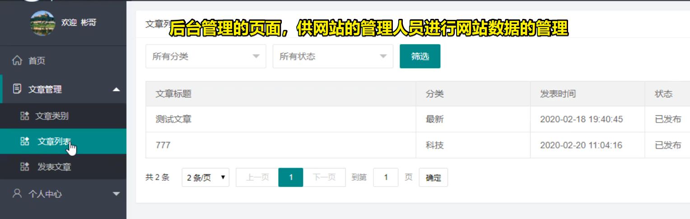

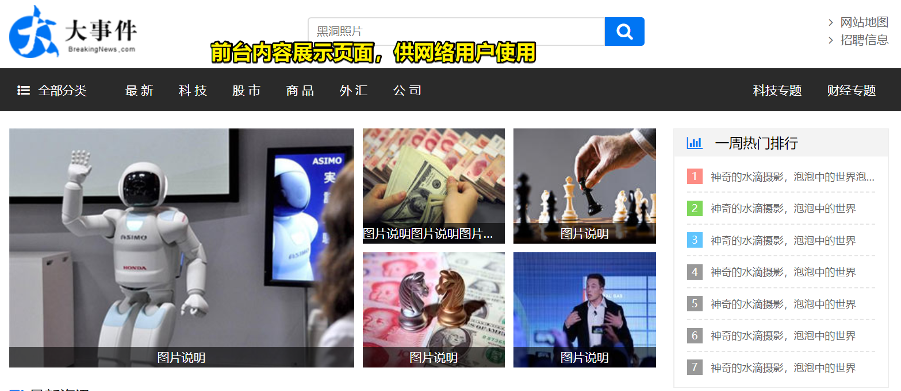

​	因为后台管理页面面向的不是真正的消费者用户，所以对于页面要求是尽可能的简洁，所以通常都是用**成熟的UI框架**进行**快速布局**！

​	我们大事件项目的后台页面是采用layui进行的布局。

## layui使用

`layui`的[官方文档](https://www.layui.com/doc/)

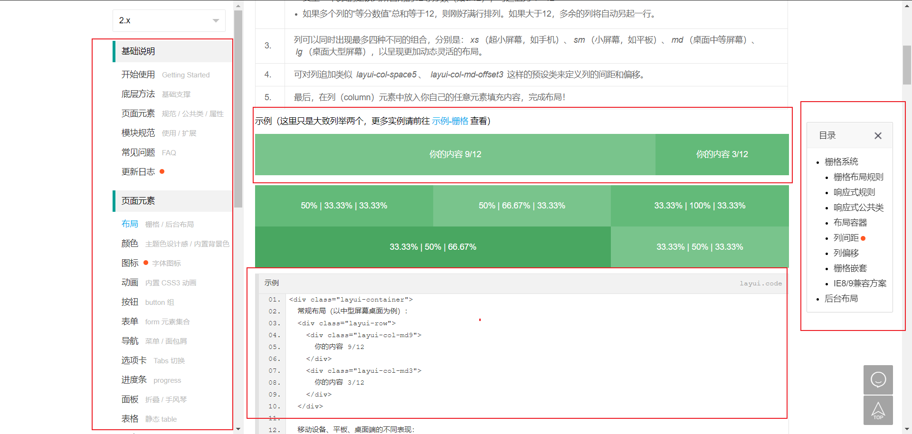

### 使用的流程(⭐⭐⭐)

- 左侧是快捷导航，能够让我们快速找到对应的一些页面效果分类或者是功能分类
- 左侧选中我们想要的分类之后，右侧会有一个子分类，例如：左侧点击的布局，那么右侧是二级分类，里面有哪些布局的结构样式
- 当选中了对应的二级分类，就会跳转到对应效果那里
- 上面是示例效果
- 下面就是示例代码
- 我们需要做的就是找到对应效果的代码，`copy`到我们项目中，然后按照我们需要的效果进行调整即可

## 一、搭建项目结构

### 第1步，在本机创建一个项目文件夹bigevent

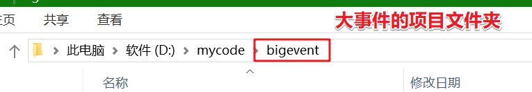

### 第2步，将素材中的文件夹复制到工作目录

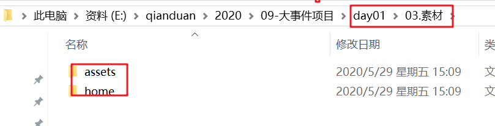

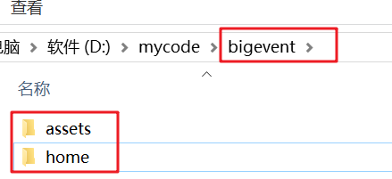

assets文件夹目录结构：

- `assets > css`  存放自己编写的**`css`代码** 文件夹
- `assets > fonts` 字体图标文件夹
- `assets > images`  存放图标文件夹
- `assets > js` 自己**`js`代码**的文件夹
- `assets > lib`  存放第三方依赖库的文件夹（例如：layui框架、jquery、arttemplate等）

### 第3步，在项目根目录下，创建login.html和index.html

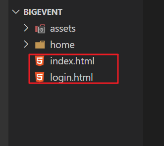

## 二、绘制login登录/注册页


### 第1步，创建login.css文件

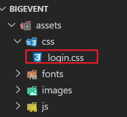


### 第2步，在login.html中引入layui.css和login.css

```html
<head>
    <meta charset="UTF-8">
    <meta name="viewport" content="width=device-width, initial-scale=1.0">
    <title>大事件-登录/注册</title>
    <!-- 引入layui.css -->
    <link rel="stylesheet" href="/assets/lib/layui/css/layui.css">
    <!-- 引入login.css -->
    <link rel="stylesheet" href="/assets/css/login.css">
</head>
```

### 第3步，设置body的背景图片

login.css

```css
html,
body {
    width: 100%;
    height: 100%;
    background: url(/assets/images/login_bg.jpg) no-repeat center;
}
```

### 第4步，布局logo区域

分为上下结构

- 上面头部的 `Logo` 区域
- 下面是 登录注册表单区域

```html
<body>
    <!-- logo区域 -->
    <div class="layui-main">
        
    </div>
</body>
```

### 第5步，布局表单区域

#### 【1】大盒子布局

login.html

```html
<body>
    <!-- logo区域 -->
    <div class="layui-main">
        
    </div>
    <!-- 表单区域 -->
    <div class="loginAndRegBox"></div>
</body>
```

login.css

```css
.loginAndRegBox {
    width: 400px;
    height: 310px;
    background-color: #fff;
    position: absolute;
    left: 50%;
    top: 50%;
    transform: translate(-50%, -50%);
}
```

#### 【2】title部分

html：

```html
<!-- 表单区域 -->
<div class="loginAndRegBox">
    <div class="title-box"></div>
</div>
```

css：

```css
.title-box {
    height: 60px;
    background: url(/assets/images/login_title.png) no-repeat center;
}
```

#### 【3】登录表单

- 找到 `layui` 文档的 `页面元素 -> 表单` 这一分类

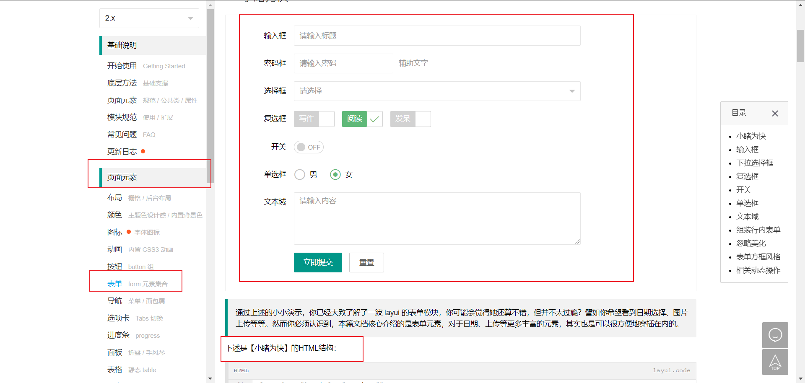

- 拷贝 里面内容，不需要全部拷贝过来，我们拷贝第一行的输入框即可，注意：外面`form`表单域需要带上
- 删除里面的 `label` 提示内容，然后把`lable` 的父元素 `div` 进行删除，不然前面`label`删除了还有空隙在左侧
- 拷贝过来对应的 `button` 按钮，然后设置样式，让宽度填充整个父元素

```html
<!-- 登录表单 -->
<div class="login-box">
    <form class="layui-form" action="">
        <!-- 用户名 -->
        <div class="layui-form-item">
            <input type="text" name="title" required lay-verify="required" placeholder="请输入标题" autocomplete="off" class="layui-input">
        </div>
        <!-- 密码 -->
        <div class="layui-form-item">
            <input type="text" name="title" required lay-verify="required" placeholder="请输入标题" autocomplete="off" class="layui-input">
        </div>
        <!-- 登录按钮 -->
        <div class="layui-form-item">
            <button class="layui-btn layui-btn-fluid" lay-submit>立即提交</button>
        </div>
        <div class="layui-form-item">
            <a href="javascript:;" id="link_reg">去注册</a>
        </div>
    </form>
</div>
```

#### 【4】美化登录表单

login.css 给表单添加内边距

```css
.layui-form {
    padding: 0 30px;
}
```

login.html 修改表单提示内容和name

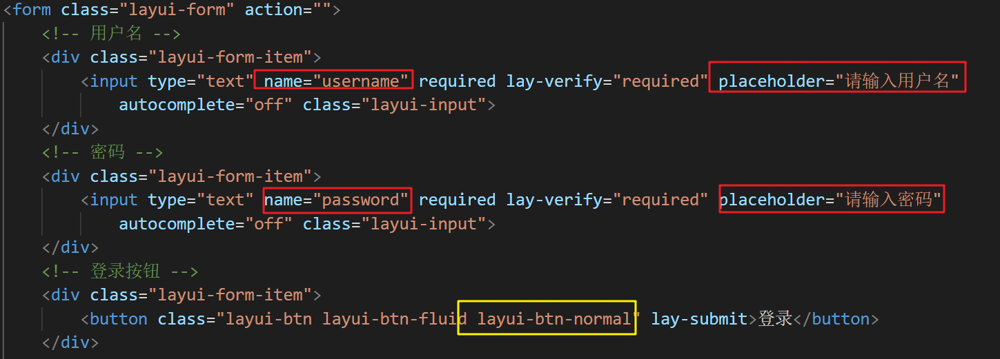

a链接，居右显示：

```
<div class="layui-form-item links">
	<a href="javascript:;" id="link_reg">去注册</a>
</div>
```

login.css

```
.links {
    display: flex;
    justify-content: flex-end;
}
.links a {
	font-size: 12px;
}
```

**`css` 最终示例代码**

```css
.layui-form {
  padding: 0 30px;
}

.links {
  display: flex;
  justify-content: flex-end;
}

.links a {
  font-size: 12px;
}
```


#### 【5】绘制文本框前面的小图标 

- 在 `layui` 中给我们提供了一些图标，我们直接使用即可


- 在用户名的文本框之前，添加如下的标签结构

```html
<i class="layui-icon layui-icon-username"></i>
```

- 在密码框之前，添加如下的标签结构

```html
<i class="layui-icon layui-icon-password"></i>
```

- 修改一下对应样式

```css
.layui-form-item {
  position: relative;
}

.layui-icon {
  position: absolute;
  left: 10px;
  top: 10px;
}

.layui-input {
  padding-left: 32px;
}
```

### 第6步，绘制注册表单的结构样式

- 注册表单与登录是差不多的，多了一个 输入框，我们把之前登录的结构直接拷贝过来
- 修改一下里面对应内容

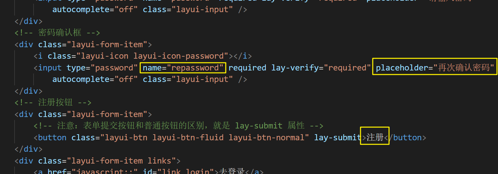

```html
  <!-- 注册的div -->
  <div class="reg-box">
    <!-- 注册的表单 -->
    <form class="layui-form" action="">
      <!-- 用户名 -->
      <div class="layui-form-item">
        <i class="layui-icon layui-icon-username"></i>
        <input type="text" name="username" required lay-verify="required" placeholder="请输入用户名" autocomplete="off" class="layui-input" />
      </div>
      <!-- 密码 -->
      <div class="layui-form-item">
        <i class="layui-icon layui-icon-password"></i>
        <input type="password" name="password" required lay-verify="required" placeholder="请输入密码" autocomplete="off" class="layui-input" />
      </div>
      <!-- 密码确认框 -->
      <div class="layui-form-item">
        <i class="layui-icon layui-icon-password"></i>
        <input type="password" name="repassword" required lay-verify="required" placeholder="再次确认密码" autocomplete="off" class="layui-input" />
      </div>
      <!-- 注册按钮 -->
      <div class="layui-form-item">
        <!-- 注意：表单提交按钮和普通按钮的区别，就是 lay-submit 属性 -->
        <button class="layui-btn layui-btn-fluid layui-btn-normal" lay-submit>注册</button>
      </div>
      <div class="layui-form-item links">
        <a href="javascript:;" id="link_login">去登录</a>
      </div>
    </form>
  </div>
```

## 三、绘制后台首页

后台首页分为4部分：头部、侧边栏、底部、内容主体区域。

### 【1】快速搭建页面结构

- 找到`LayUI` 文档里面  页面元素 > 布局 > 后台布局

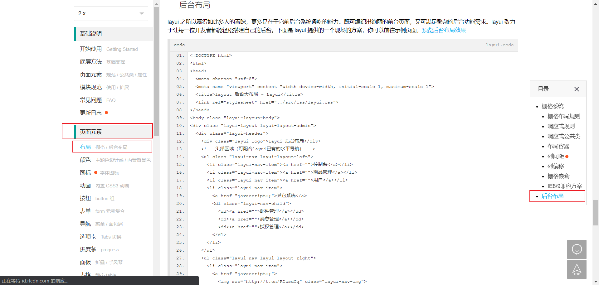

- 拷贝里面的代码，修改以下对应的文字内容

**要拷贝的代码**

```html
<body class="layui-layout-body">
<div class="layui-layout layui-layout-admin">
  <div class="layui-header">
    <div class="layui-logo">layui 后台布局</div>
    <!-- 头部区域（可配合layui已有的水平导航） -->
    <ul class="layui-nav layui-layout-left">
      <li class="layui-nav-item"><a href="">控制台</a></li>
      <li class="layui-nav-item"><a href="">商品管理</a></li>
      <li class="layui-nav-item"><a href="">用户</a></li>
      <li class="layui-nav-item">
        <a href="javascript:;">其它系统</a>
        <dl class="layui-nav-child">
          <dd><a href="">邮件管理</a></dd>
          <dd><a href="">消息管理</a></dd>
          <dd><a href="">授权管理</a></dd>
        </dl>
      </li>
    </ul>
    <ul class="layui-nav layui-layout-right">
      <li class="layui-nav-item">
        <a href="javascript:;">
          
          贤心
        </a>
        <dl class="layui-nav-child">
          <dd><a href="">基本资料</a></dd>
          <dd><a href="">安全设置</a></dd>
        </dl>
      </li>
      <li class="layui-nav-item"><a href="">退了</a></li>
    </ul>
  </div>
  
  <div class="layui-side layui-bg-black">
    <div class="layui-side-scroll">
      <!-- 左侧导航区域（可配合layui已有的垂直导航） -->
      <ul class="layui-nav layui-nav-tree"  lay-filter="test">
        <li class="layui-nav-item layui-nav-itemed">
          <a class="" href="javascript:;">所有商品</a>
          <dl class="layui-nav-child">
            <dd><a href="javascript:;">列表一</a></dd>
            <dd><a href="javascript:;">列表二</a></dd>
            <dd><a href="javascript:;">列表三</a></dd>
            <dd><a href="">超链接</a></dd>
          </dl>
        </li>
        <li class="layui-nav-item">
          <a href="javascript:;">解决方案</a>
          <dl class="layui-nav-child">
            <dd><a href="javascript:;">列表一</a></dd>
            <dd><a href="javascript:;">列表二</a></dd>
            <dd><a href="">超链接</a></dd>
          </dl>
        </li>
        <li class="layui-nav-item"><a href="">云市场</a></li>
        <li class="layui-nav-item"><a href="">发布商品</a></li>
      </ul>
    </div>
  </div>
  
  <div class="layui-body">
    <!-- 内容主体区域 -->
    <div style="padding: 15px;">内容主体区域</div>
  </div>
  
  <div class="layui-footer">
    <!-- 底部固定区域 -->
    © layui.com - 底部固定区域
  </div>
</div>
<script src="../src/layui.js"></script>
<script>
//JavaScript代码区域
layui.use('element', function(){
  var element = layui.element;
  
});
</script>
</body>
```

### 【2】修改基础的结构代码

- 删除多余的js代码
- 修改title
- 引入layui的css文件

```html
<!DOCTYPE html>
<html lang="zh-CN">

<head>
    <meta charset="UTF-8">
    <meta name="viewport" content="width=device-width, initial-scale=1.0">
    <title>后台首页</title>
    <!-- 引入layui的css文件 -->
    <link rel="stylesheet" href="/assets/lib//layui/css/layui.css">
</head>

<body class="layui-layout-body">
    <div class="layui-layout layui-layout-admin">
        <div class="layui-header">
            <div class="layui-logo">layui 后台布局</div>
            <!-- 头部区域（可配合layui已有的水平导航） -->
            <ul class="layui-nav layui-layout-left">
                <li class="layui-nav-item"><a href="">控制台</a></li>
                <li class="layui-nav-item"><a href="">商品管理</a></li>
                <li class="layui-nav-item"><a href="">用户</a></li>
                <li class="layui-nav-item">
                    <a href="javascript:;">其它系统</a>
                    <dl class="layui-nav-child">
                        <dd><a href="">邮件管理</a></dd>
                        <dd><a href="">消息管理</a></dd>
                        <dd><a href="">授权管理</a></dd>
                    </dl>
                </li>
            </ul>
            <ul class="layui-nav layui-layout-right">
                <li class="layui-nav-item">
                    <a href="javascript:;">
                        
                        贤心
                    </a>
                    <dl class="layui-nav-child">
                        <dd><a href="">基本资料</a></dd>
                        <dd><a href="">安全设置</a></dd>
                    </dl>
                </li>
                <li class="layui-nav-item"><a href="">退了</a></li>
            </ul>
        </div>

        <div class="layui-side layui-bg-black">
            <div class="layui-side-scroll">
                <!-- 左侧导航区域（可配合layui已有的垂直导航） -->
                <ul class="layui-nav layui-nav-tree" lay-filter="test">
                    <li class="layui-nav-item layui-nav-itemed">
                        <a class="" href="javascript:;">所有商品</a>
                        <dl class="layui-nav-child">
                            <dd><a href="javascript:;">列表一</a></dd>
                            <dd><a href="javascript:;">列表二</a></dd>
                            <dd><a href="javascript:;">列表三</a></dd>
                            <dd><a href="">超链接</a></dd>
                        </dl>
                    </li>
                    <li class="layui-nav-item">
                        <a href="javascript:;">解决方案</a>
                        <dl class="layui-nav-child">
                            <dd><a href="javascript:;">列表一</a></dd>
                            <dd><a href="javascript:;">列表二</a></dd>
                            <dd><a href="">超链接</a></dd>
                        </dl>
                    </li>
                    <li class="layui-nav-item"><a href="">云市场</a></li>
                    <li class="layui-nav-item"><a href="">发布商品</a></li>
                </ul>
            </div>
        </div>

        <div class="layui-body">
            <!-- 内容主体区域 -->
            <div style="padding: 15px;">内容主体区域</div>
        </div>

        <div class="layui-footer">
            <!-- 底部固定区域 -->
            © layui.com - 底部固定区域
        </div>
    </div>
</body>

</html>
```

### 【3】后台首页头部搭建

#### 1）删除头部多余的菜单项

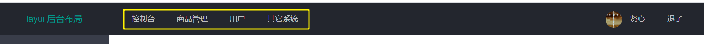

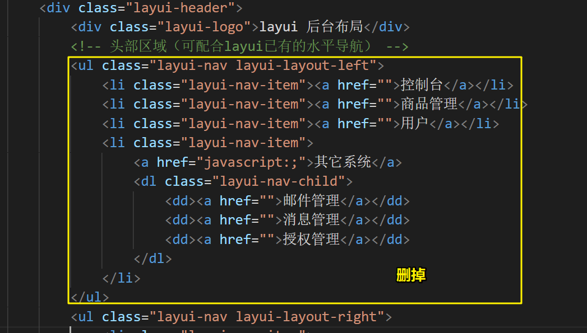

#### 2）头部添加logo图片

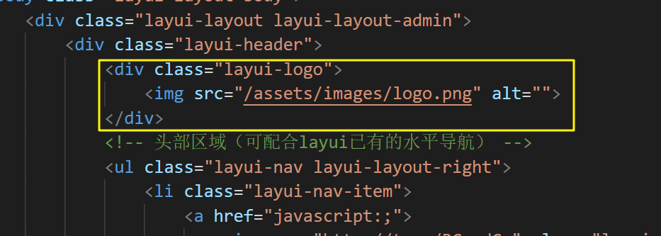


#### 3）头部右侧菜单修改

##### 第1步，修改html标签

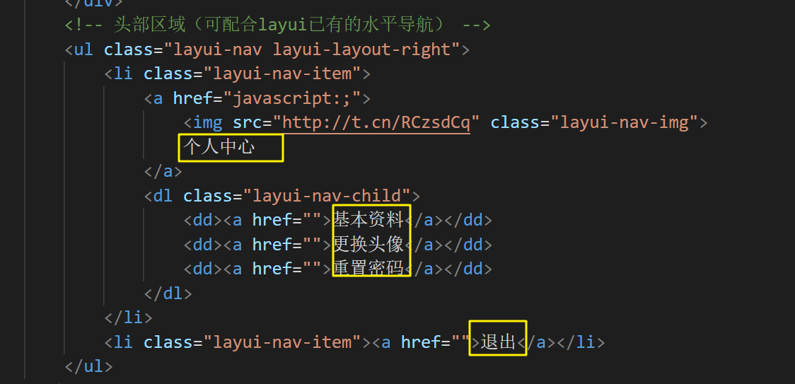

##### 第2步，引入layui的js文件

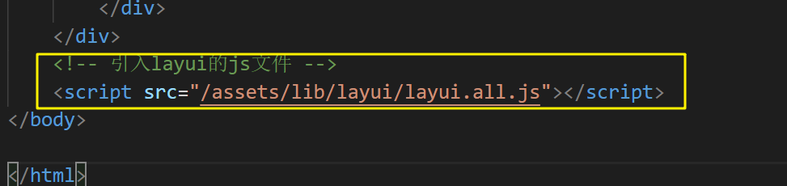

最终效果：

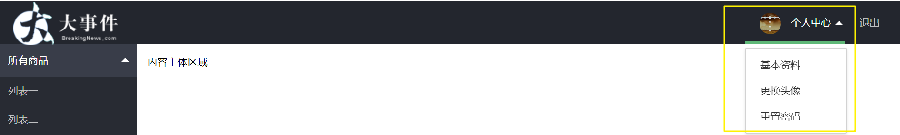

### 【4】侧边栏

#### 1）修改html结构

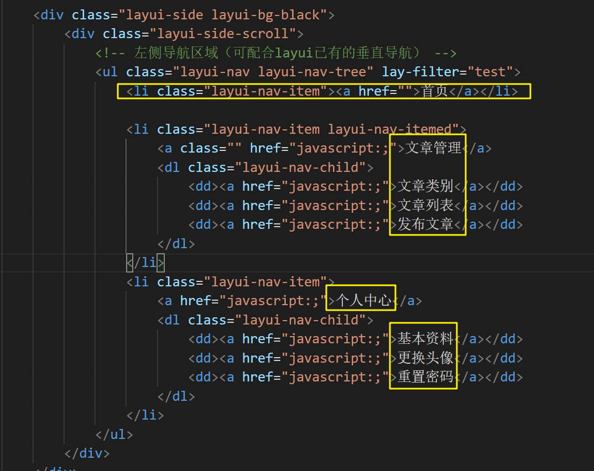

#### 2）去掉“文章管理”默认展开

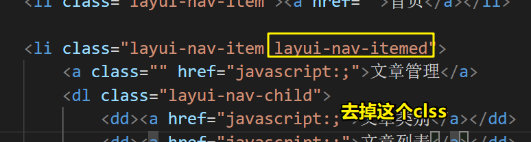

### 【5】footer底部文字居中

##### 1）修改底部footer的文字

```
        <div class="layui-footer">
            <!-- 底部固定区域 -->
            © www.itheima.com - 黑马程序员
        </div>
```

##### 2）创建index.css文件，并引入进来

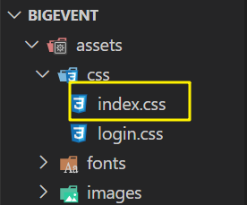

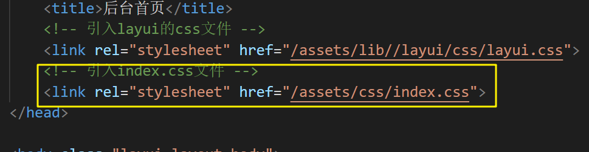

##### 3）让文字居中

```css
.layui-footer {
    text-align: center;
    font-size: 12px;
}
```

### 【6】侧边栏菜单互斥

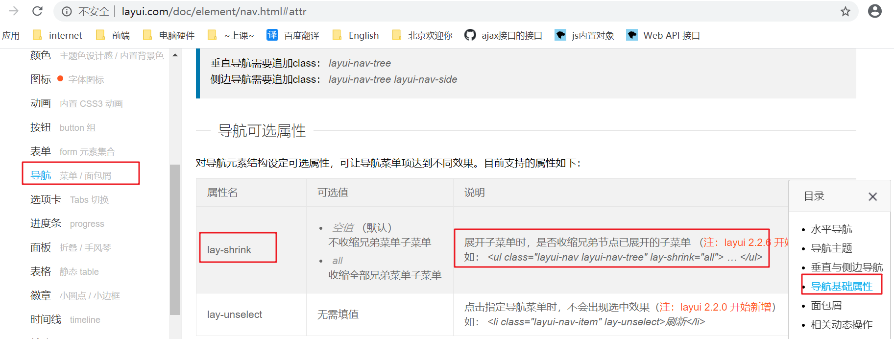

代码修改如下：

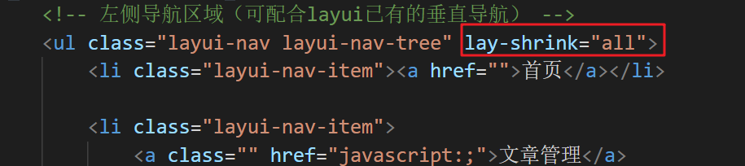

### 【7】为侧边栏大菜单项添加图标

利用第三方的字体图标库来实现，图标库的相关文件都在assets/fonts目录中。

##### 1）导入字体图标库的样式文件

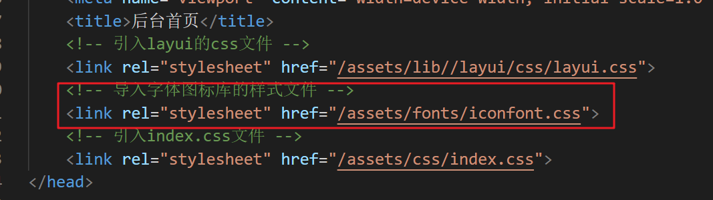

##### 2）在菜单项之前添加span标签

##### 3）给span标签添加class

```html
<li class="layui-nav-item">
    <a href="">
    	<span class="iconfont icon-tuichu"></span>退出
    </a>
</li>

<li class="layui-nav-item">
    <a href="">
        <span class="iconfont icon-home"></span>首页
    </a>
</li>

 <a class="" href="javascript:;">
     <span class="iconfont icon-16"></span>文章管理
</a>

<a href="javascript:;">
    <span class="iconfont icon-user"></span>个人中心
</a>
```

##### 4）修改图标标签的样式

```
.iconfont {
    margin-right: 8px;
}
```

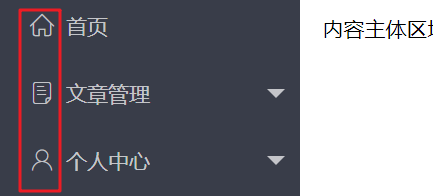

### 【8】为侧边栏小菜单项添加图标

使用layui自带的图标库来实现。

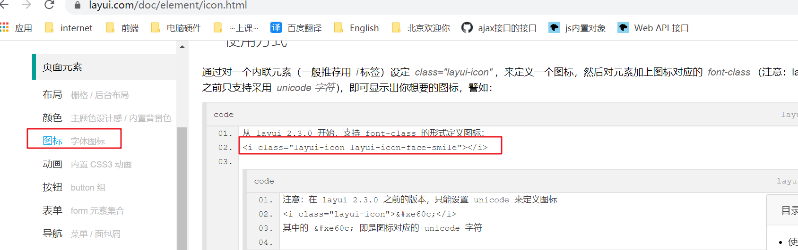

##### 1）在子菜单项之前添加图标标签

```
<dd><a href="javascript:;"><i class="layui-icon layui-icon-app"></i>基本资料</a></dd>
```

##### 2）设置图标标签的样式

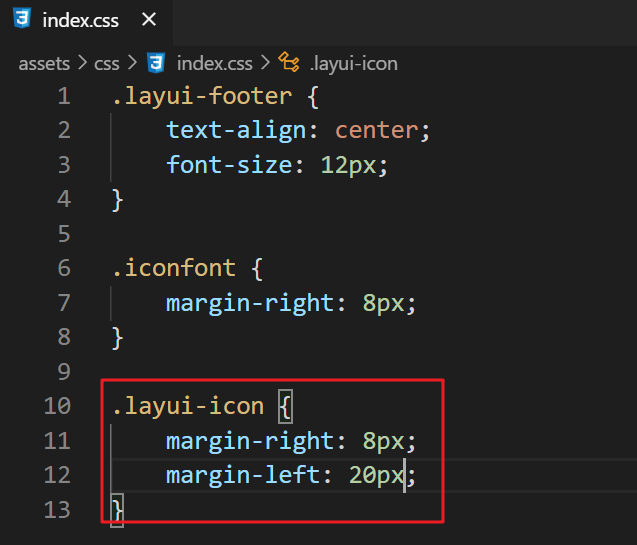

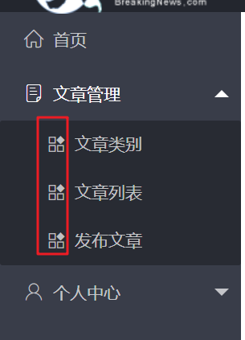

### 【9】iframe标签介绍

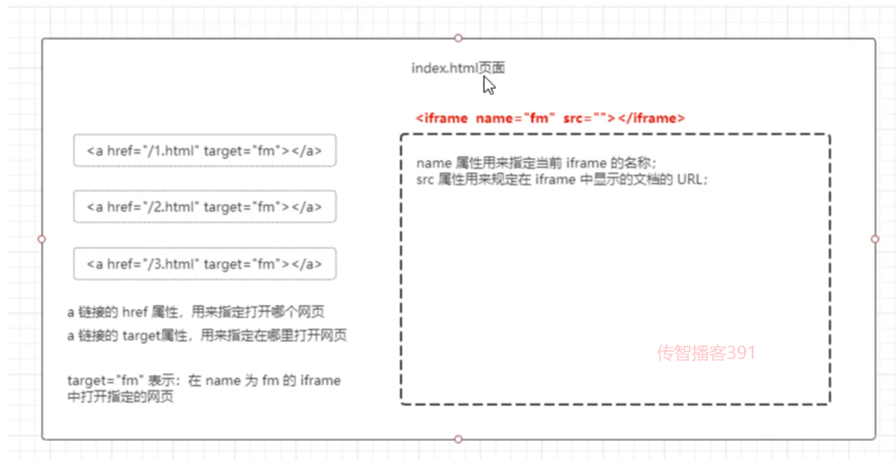

### 【10】内容主体区域⭐

- 在页面主体的 div 中添加 `iframe`

```html
  <div class="layui-body">
    <!-- 内容主体区域 -->
    <iframe name="fm" src="" frameborder="0"></iframe>
  </div>
```

- 为`首页`链接添加`href`和`target`属性

```html
<a href="/home/dashboard.html" target="fm"><span class="iconfont icon-home"></span>首页</a>
```

- 设置对应样式

```css
iframe {
  width: 100%;
  height: 100%;
}

.layui-body {
  overflow: hidden;
}
```

- 指定默认 `iframe` 页面，添加 `src` 的属性即可

```html
<iframe name="fm" src="/home/dashboard.html" frameborder="0"></iframe>
```

- 为 `首页` 对应的导航 Item 项添加默认高亮效果， `layui-this` 属性

**菜单项默认被选中**。

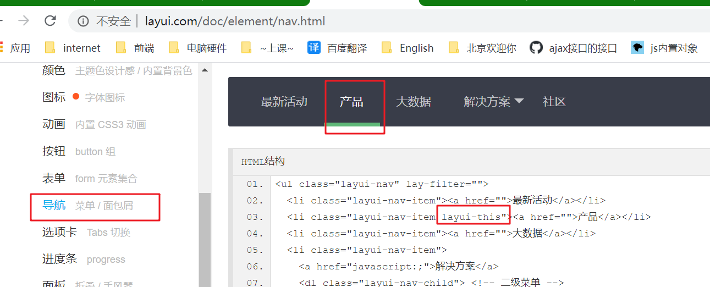

```html
<li class="layui-nav-item layui-this">
  <a href="/home/dashboard.html" target="fm"><span class="iconfont icon-home"></span>首页</a>
</li>
```

- 强制清除 `<a>` 链接的 `CSS3` 动画（页面加载时，a标签会有一个小动画）

```css
a {
  transition: none !important;
}
```

### 【11】绘制头像区域

如果用户有图片头像，则显示图片。如果没有图片头像，则显示文字头像（用户名的第1个字符）。

最终，只有1个头像显示！

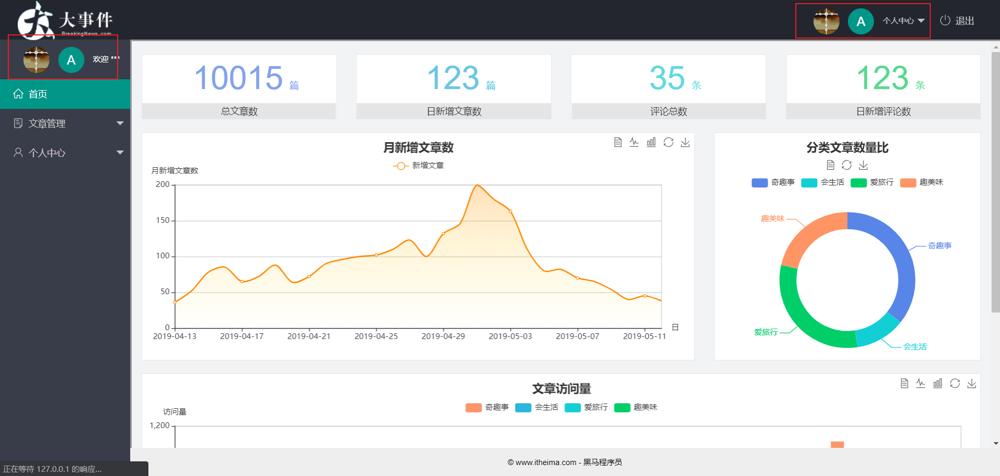

- 找到对应的位置，添加如下结构

```html
<!-- 头部导航栏上面头像 -->
<a href="javascript:;" class="userinfo">
  
  <span class="text-avatar">A</span>
  个人中心
</a>


<!-- 左侧侧边栏上面头像 -->
<div class="userinfo">
    
    <span class="text-avatar">A</span>
    <span id="welcome">欢迎 ***</span>
</div>
```

- 修改对应的样式

```css
.userinfo {
  height: 60px;
  line-height: 60px;
  text-align: center;
  font-size: 12px;
  user-select: none;
}

.layui-side-scroll .userinfo {
  border-bottom: 1px solid #282b33;
}

.layui-nav-img {
  width: 40px;
  height: 40px;
}

.text-avatar {
  display: inline-block;
  width: 40px;
  height: 40px;
  background-color: #009688;
  border-radius: 50%;
  line-height: 40px;
  text-align: center;
  font-size: 20px;
  color: #fff;
  position: relative;
  top: 4px;
  margin-right: 10px;
}
```

## 四、绘制个人中心-基本资料页

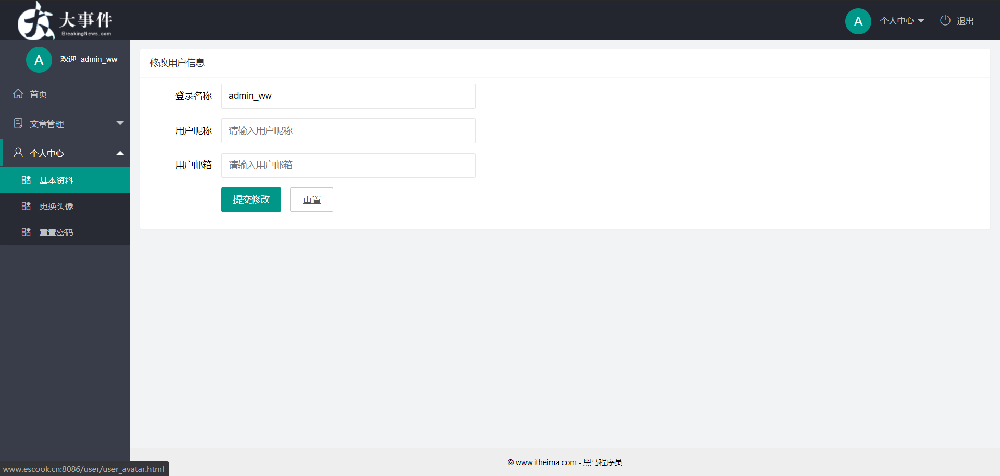

### 【1】创建基本资料对应的页面

- 新建一个 `user` 文件夹

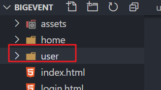

- 新建  `/user/user_info.html`  页面
- 在`index.html` 里面指定，点击对应的`a`标签要打开的页面，并且指定在哪里进行打开

```html
<a href="/user/user_info.html" target="fm"><i class="layui-icon layui-icon-app"></i>基本资料</a>
```

- 搭建页面结构，利用 `layui` 的卡片的组件来实现


**结构示例代码**

```html
<!DOCTYPE html>
<html lang="en">
  <head>
    <meta charset="UTF-8" />
    <meta name="viewport" content="width=device-width, initial-scale=1.0" />
    <title>Document</title>
    <!-- 导入 layui 的样式 -->
    <link rel="stylesheet" href="/assets/lib/layui/css/layui.css" />
    <!-- 导入自己的样式 -->
    <link rel="stylesheet" href="/assets/css/user/user_info.css" />
  </head>
  <body>
    <!-- 卡片区域 -->
    <div class="layui-card">
      <div class="layui-card-header">修改用户信息</div>
      <div class="layui-card-body">
        卡片式面板面板通常用于非白色背景色的主体内<br />
        从而映衬出边框投影
      </div>
    </div>
  </body>
</html>
```

- 新建 `/assets/css/user/user_info.css`

```css
html,
body {
  margin: 0;
  padding: 0;
}

body {
  background-color: #f2f3f5;
  padding: 15px;
}
.layui-form {
    width: 500px;
}
```

### 【2】 绘制基本资料对应的表单

- 利用 `layui` 中表单元素来搭建
- 一共使用 三个 input 输入框的结构
- 还需要一个 提交按钮 和 重置按钮

```html
<!-- form 表单区域 -->
<form class="layui-form" action="">
  <div class="layui-form-item">
    <label class="layui-form-label">登录名称</label>
    <div class="layui-input-block">
      <input type="text" name="username" required lay-verify="required" placeholder="请输入登录名称" autocomplete="off" class="layui-input" readonly />
    </div>
  </div>
  <div class="layui-form-item">
    <label class="layui-form-label">用户昵称</label>
    <div class="layui-input-block">
      <input type="text" name="nickname" required lay-verify="required|nickname" placeholder="请输入用户昵称" autocomplete="off" class="layui-input" />
    </div>
  </div>
  <div class="layui-form-item">
    <label class="layui-form-label">用户邮箱</label>
    <div class="layui-input-block">
      <input type="text" name="email" required lay-verify="required|email" placeholder="请输入用户邮箱" autocomplete="off" class="layui-input" />
    </div>
  </div>
  <div class="layui-form-item">
    <div class="layui-input-block">
      <button class="layui-btn" lay-submit lay-filter="formDemo">提交修改</button>
      <button type="reset" class="layui-btn layui-btn-primary">重置</button>
    </div>
  </div>
</form>
```

## 五、绘制个人中心-重置密码页

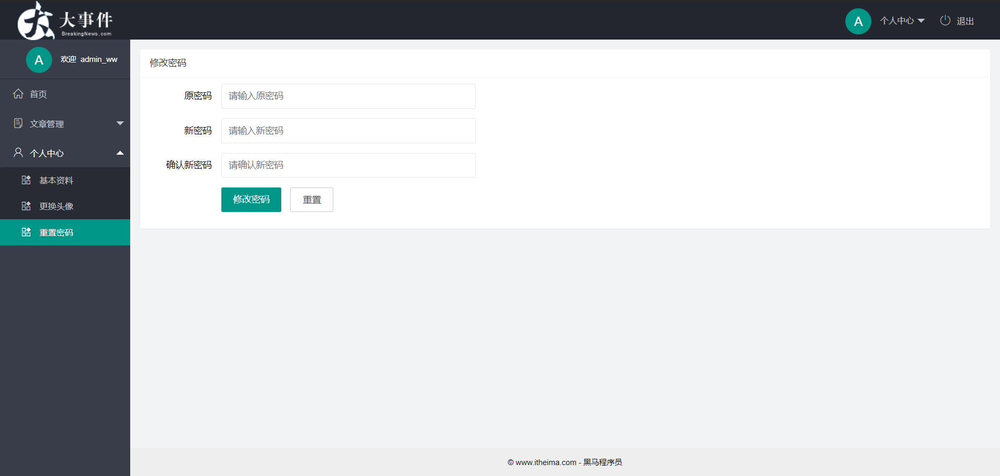


- 新建重置密码的页面，`user_pwd.html`，给侧边栏对应a标签设置 `href`的路径，以及`target`属性

```
<dd>
	<a href="/user/user_pwd.html" target="fm">
	<i class="layui-icon layui-icon-app"></i>重置密码</a>
</dd>
```

- 利用 `layui` 的卡片（页面元素 > 面板 > 卡片布局） 搭建结构
- 利用 `layui` 的表单元素（页面元素 > 表单）来搭建里面内容
- 修改下里面的文字内容

```html
<!DOCTYPE html>
<html lang="en">
  <head>
    <meta charset="UTF-8" />
    <meta name="viewport" content="width=device-width, initial-scale=1.0" />
    <title>Document</title>
    <link rel="stylesheet" href="/assets/lib/layui/css/layui.css" />
    <link rel="stylesheet" href="/assets/css/user/user_pwd.css" />
  </head>
  <body>
    <!-- 卡片区域 -->
    <div class="layui-card">
      <div class="layui-card-header">修改密码</div>
      <div class="layui-card-body">
        <form class="layui-form">
          <div class="layui-form-item">
            <label class="layui-form-label">原密码</label>
            <div class="layui-input-block">
              <input type="password" name="oldPwd" required lay-verify="required" placeholder="请输入原密码" autocomplete="off" class="layui-input" />
            </div>
          </div>
          <div class="layui-form-item">
            <label class="layui-form-label">新密码</label>
            <div class="layui-input-block">
              <input type="password" name="newPwd" required lay-verify="required" placeholder="请输入新密码" autocomplete="off" class="layui-input" />
            </div>
          </div>
          <div class="layui-form-item">
            <label class="layui-form-label">确认新密码</label>
            <div class="layui-input-block">
              <input type="password" name="rePwd" required lay-verify="required" placeholder="请再次确认密码" autocomplete="off" class="layui-input" />
            </div>
          </div>
          <div class="layui-form-item">
            <div class="layui-input-block">
              <button class="layui-btn" lay-submit lay-filter="formDemo">修改密码</button>
              <button type="reset" class="layui-btn layui-btn-primary">重置</button>
            </div>
          </div>
        </form>
      </div>
    </div>
  </body>
</html>
```

- 新建样式文件，在 `/assets/css/user/user_pwd.css` 中编写相关样式

```css
html,
body {
  margin: 0;
  padding: 0;
}

body {
  padding: 15px;
  background-color: #f2f3f5;
}

.layui-form {
  width: 500px;
}
```

## 六、绘制更换头像页

### 【1】初步渲染更换头像页面的结构

- 创建 `/user/user_avatar.html` 页面
- 放入卡片区域  (页面元素 > 面板 > 卡片)，修改对应文字信息
- 创建css文件，`/assets/css/user/user_avatar.css`，并引入到页面

```html
<!DOCTYPE html>
<html lang="en">
  <head>
    <meta charset="UTF-8" />
    <meta name="viewport" content="width=device-width, initial-scale=1.0" />
    <title>Document</title>
    <link rel="stylesheet" href="/assets/lib/layui/css/layui.css" />
    <link rel="stylesheet" href="/assets/css/user/user_avatar.css" />
  </head>
  <body>
    <!-- 卡片区域 -->
    <div class="layui-card">
      <div class="layui-card-header">更换头像</div>
      <div class="layui-card-body">
        卡片式面板面板通常用于非白色背景色的主体内<br />
        从而映衬出边框投影
      </div>
    </div>
  </body>
</html>
```

- 修改一下对应样式

```css
html,
body {
  margin: 0;
  padding: 0;
}

body {
  padding: 15px;
  background-color: #f2f3f5;
}
```

- 在侧边栏对应的 `a` 标签设置 `href` 属性 和 `target` 属性，修改 `index.html` 中对应链接的属性

```html
<a href="/user/user_avatar.html" target="fm"><i class="layui-icon layui-icon-app"></i>更换头像</a>
```

### 【2】绘制页面各个部分结构和样式

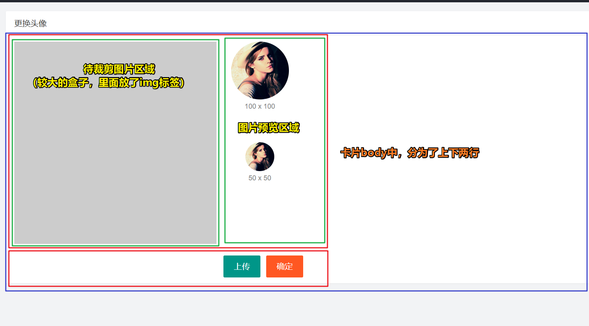

填充结构：

```html
  <!-- 第一行的图片裁剪和预览区域 -->
  <div class="row1">
    <!-- 图片裁剪区域 -->
    <div class="cropper-box">
      <!-- 这个 img 标签很重要，将来会把它初始化为裁剪区域 -->
      
    </div>
    <!-- 图片的预览区域 -->
    <div class="preview-box">
      <div>
        <!-- 宽高为 100px 的预览区域 -->
        <div class="img-preview w100"></div>
        <p class="size">100 x 100</p>
      </div>
      <div>
        <!-- 宽高为 50px 的预览区域 -->
        <div class="img-preview w50"></div>
        <p class="size">50 x 50</p>
      </div>
    </div>
  </div>

  <!-- 第二行的按钮区域 -->
  <div class="row2">
    <button type="button" class="layui-btn">上传</button>
    <button type="button" class="layui-btn layui-btn-danger">确定</button>
  </div>
```

美化样式：

```css
/* 设置卡片主体区域的宽度 */
.layui-card-body {
  width: 500px;
}

/* 设置按钮行的样式 */
.row2 {
    display: flex;
    justify-content: flex-end;
    margin-top: 20px;
}

/* 设置裁剪区域的样式 */
.cropper-box {
    width: 350px;
    height: 350px;
    background-color: #ccc;
    overflow: hidden;
}

.cropper-box img {
    width: 100%;
}

/* 设置第一个预览区域的样式 */
.w100 {
    width: 100px;
    height: 100px;
    background-color: gray;
}

/* 设置第二个预览区域的样式 */
.w50 {
    width: 50px;
    height: 50px;
    background-color: gray;
    margin-top: 50px;
}

/* 设置预览区域下方文本的样式 */
.size {
    font-size: 12px;
    color: gray;
    text-align: center;
}

/* 设置图片行的样式 */
.row1 {
    display: flex;
}

/* 设置 preview-box 区域的的样式 */
.preview-box {
    display: flex;
    flex-direction: column;
    flex: 1;
    align-items: center;
}

/* 设置 img-preview 区域的样式 */
.img-preview {
    overflow: hidden;
    border-radius: 50%;
    background: url(/assets/images/sample.jpg) no-repeat center;
    background-size: 100%;
}
```


## 七、绘制文章分类页

- 创建 `/article/art_cate.html` 页面，并初始化如下的`UI`结构

```html
<!DOCTYPE html>
<html lang="en">
  <head>
    <meta charset="UTF-8" />
    <meta name="viewport" content="width=device-width, initial-scale=1.0" />
    <title>Document</title>
    <link rel="stylesheet" href="/assets/lib/layui/css/layui.css" />
    <link rel="stylesheet" href="/assets/css/article/art_cate.css" />
  </head>
  <body>
    <!-- 卡片区域 -->
    <div class="layui-card">
      <div class="layui-card-header">
        <span>文章类别管理</span>
        <button type="button" class="layui-btn layui-btn-normal layui-btn-sm">添加类别</button>
      </div>
      <div class="layui-card-body">
        <table class="layui-table">
          <colgroup>
            <col />
            <col />
            <col width="200" />
          </colgroup>
          <thead>
            <tr>
              <th>分类名称</th>
              <th>分类别名</th>
              <th>操作</th>
            </tr>
          </thead>
          <tbody>
            <tr>
              <td>贤心</td>
              <td>2016-11-29</td>
               <td>
                   <button type="button" class="layui-btn layui-btn-xs">编辑</button>
                   <button type="button" class="layui-btn layui-btn-danger layui-btn-xs">删除</button>
               </td>
            </tr>
            <tr>
              <td>许闲心</td>
              <td>2016-11-28</td>
              <td>
                   <button type="button" class="layui-btn layui-btn-xs">编辑</button>
                   <button type="button" class="layui-btn layui-btn-danger layui-btn-xs">删除</button>
               </td>
            </tr>
          </tbody>
        </table>
      </div>
    </div>
  </body>
</html>
```

- 定义 `/assets/css/article/art_cate.css` 美化样式

```css
html,
body {
  margin: 0;
  padding: 0;
}

body {
  padding: 15px;
  background-color: #f2f3f5;
}
/*
	在 `layui-card-header`里面添加右侧的按钮
	给 `layui-card-header` 设置成flex 布局，让里面内容两侧对齐 
	`justify-content: space-between`
*/
.layui-card-header {
  display: flex;
  justify-content: space-between;
  align-items: center;
}
```

- 修改 `index.html` 中对应的 `<a>` 链接

```html
<a href="/article/art_cate.html" target="fm"><i class="layui-icon layui-icon-app"></i>文章类别</a>
```

## 八、绘制文章列表页

### 创建文章列表页面

- 新建 `/article/art_list.html` 页面
  - 利用 卡片区域搭建结构
- 新建 `/assets/css/article/art_list.css` 样式表
- 修改index.html中a标签的href和target

```html
<!DOCTYPE html>
<html lang="en">
  <head>
    <meta charset="UTF-8" />
    <meta name="viewport" content="width=device-width, initial-scale=1.0" />
    <title>Document</title>
    <link rel="stylesheet" href="/assets/lib/layui/css/layui.css" />
    <link rel="stylesheet" href="/assets/css/article/art_list.css" />
  </head>
  <body>
    <!-- 卡片区域 -->
    <div class="layui-card">
      <div class="layui-card-header">文章列表</div>
      <div class="layui-card-body">
         xxx 
      </div>
    </div>
  </body>
</html>
```

- 新建 `/assets/css/article/art_list.css` 样式表

```css
html,
body {
  margin: 0;
  padding: 0;
}

body {
  padding: 15px;
  background-color: #f2f3f5;
}
```

### 【1】表格列表数据区域

添加表格结构：

```html
<!-- 列表区域 -->
<table class="layui-table">
  <colgroup>
    <col />
    <col width="150" />
    <col width="180" />
    <col width="150" />
    <col width="150" />
  </colgroup>
  <thead>
    <tr>
      <th>文章标题</th>
      <th>分类</th>
      <th>发表时间</th>
      <th>状态</th>
      <th>操作</th>
    </tr>
  </thead>
  <tbody>
      <tr>
        <td>文章标题</td>
        <td>分类</td>
        <td>发表时间</td>
        <td>草稿</td>
        <td>
          <button type="button" class="layui-btn layui-btn-xs">编辑</button>
          <button type="button" class="layui-btn layui-btn-danger layui-btn-xs">删除</button>
        </td>
      </tr>
  </tbody>
</table>
```

### 【2】筛选区域

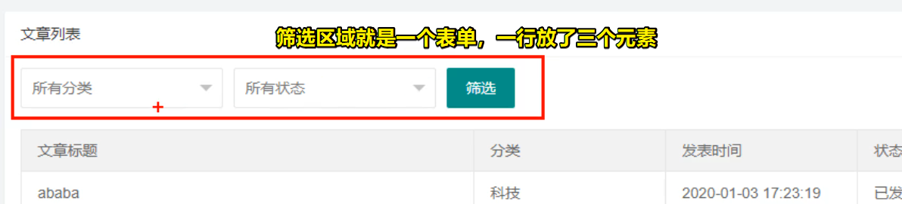


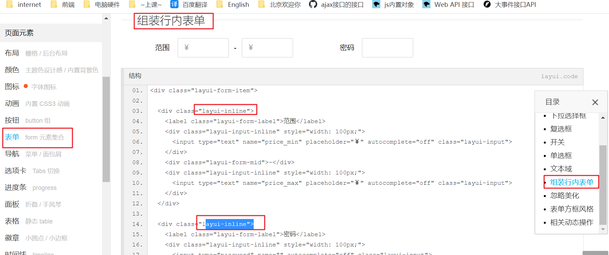

- 绘制 `UI` 结构
  - 默认的 两个select 和 button 都是独自占据一行的
  - 我们可以给三个模块设置 `layui-inline`
  - 分类的数据是动态进行获取的，第一个下拉框我们先不设置内容
  - 第二个下拉选择框里面内容是死的，我们可以定义三个 option 添加对应的内容即可
- 结构代码（放到列表区域的上面）：

```html
<!-- 筛选区域 -->
<form class="layui-form" id="form-search">
    <div class="layui-form-item layui-inline">
        <select name="cate_id"></select>
    </div>
    <div class="layui-form-item layui-inline">
        <select name="state">
            <option value="">所有状态</option>
            <option value="已发布">已发布</option>
            <option value="草稿">草稿</option>
        </select>
    </div>
    <div class="layui-form-item layui-inline">
        <button class="layui-btn" lay-submit lay-filter="formDemo">筛选</button>
    </div>
</form>
<!-- 列表区域 -->
```

- 表单项的name和请求参数的名称保持一致。

## 九、绘制文章发布页


### 【1】绘制基本结构

- 新建 `/article/art_pub.html` 文件，并进行页面结构搭建
- 新建 `/assets/css/article/art_pub.css` 样式文件
- 在页面导入相关的css文件
  - 利用卡片区域进行结构布局
- 修改index.html中a标签的href和target

```html
<!DOCTYPE html>
<html lang="en">
  <head>
    <meta charset="UTF-8" />
    <meta name="viewport" content="width=device-width, initial-scale=1.0" />
    <title>Document</title>
    <link rel="stylesheet" href="/assets/lib/layui/css/layui.css" />
    <link rel="stylesheet" href="/assets/css/article/art_pub.css" />
  </head>
  <body>
    <!-- 卡片区域 -->
    <div class="layui-card">
      <div class="layui-card-header">写文章</div>
      <div class="layui-card-body">
        卡片式面板面板通常用于非白色背景色的主体内<br />
        从而映衬出边框投影
      </div>
    </div>
    <script src="/assets/lib/layui/layui.all.js"></script>
  </body>
</html>
```

- 新建 `/assets/css/article/art_pub.css` 样式文件

```css
html,
body {
  margin: 0;
  padding: 0;
}

body {
  padding: 15px;
  background-color: #f2f3f5;
}
```

### 【2】绘制基本的表单结构

- 自上而下  文章标题 -> 文章类别 -> 文章内容 -> 文章封面 -> 表单操作按钮

```html
<!-- 发布文章的表单 -->
<form class="layui-form">
  <div class="layui-form-item">
    <label class="layui-form-label">文章标题</label>
    <div class="layui-input-block">
      <input type="text" name="title" required lay-verify="required" placeholder="请输入标题" autocomplete="off" class="layui-input" />
    </div>
  </div>
</form>
```

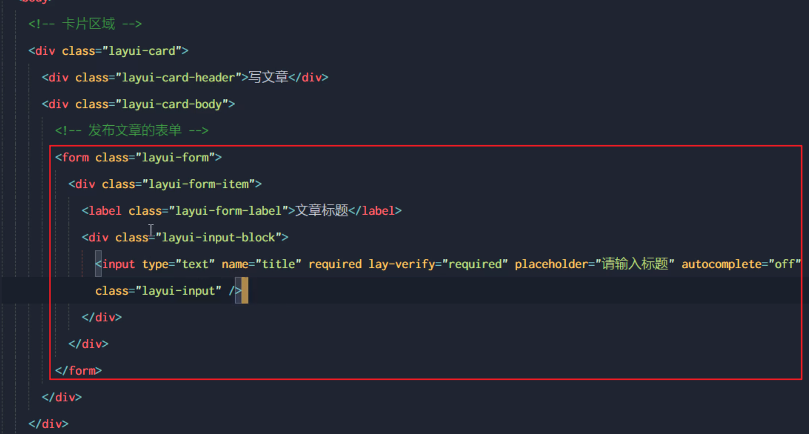

### 【3】绘制文章类别的下拉列表

- 表单的第一行是文章标题
- 表单的第二行应该是下拉选择框 `select`，必填项，里面的内容是动态进行获取的
- 注意：要引入layui.all.js，否则表单控件没有效果

```html
<!-- 第二行 -->
<div class="layui-form-item">
  <label class="layui-form-label">文章类别</label>
  <div class="layui-input-block">
    <select name="cate_id" lay-verify="required">
        <option value="">请选择文章分类</option>
      </select>
  </div>
</div>
```

