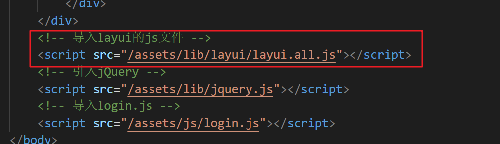

# 目标

- 利用`Git`管理大事件项目代码
- 安装并且使用 `Live Server`插件
- 学会查阅`layui`文档
- 绘制出登录注册页面结构
- 添加表单元素自定义验证规则
- 查阅接口文档完成登录注册功能
- 知道`iframe`标签的使用
- 搭建后台主页界面

# 资源地址

1. 线上 `DEMO` 项目地址：http://www.escook.cn:8086/
2. 项目的 `API` 接口地址： https://www.showdoc.cc/escook?page_id=3707158761215217

# 0. 今天完成的功能效果

- 登录功能实现
- 注册功能实现


# 1. 项目前期的准备工作

## 1.1 项目结构搭建（直接使用素材中准备好的静态页面）

- 将 `素材` 目录下的 `assets` 和 `home` 文件夹，拷贝到 `code` 目录下
  - `assets > css` 文件夹 自己编写的`css`代码
  - `assets > fonts` 字体图标文件夹
  - `assets > images`  存放图标文件夹
  - `assets > js` 自己`js`代码的文件夹
  - `assets > lib`  第三方依赖的文件夹
  - `home > dashboard.html` 后台首页的页面效果
- 在 `code` 目录下新建 `login.html` 和 `index.html` 页面

## 1.2 使用`GitHub`管理大事件的项目在 `code` 目录中运行 `git init` 命令，初始化仓库

- 在 `code` 目录中运行 `git add .` 命令，追踪要托管的文件
- 在 `code` 目录下运行 `git commit -m "init project"` 命令，提交到本地仓库
- 新建 `Github` 仓库 `web_bigevent`
  - 登录 `github` 官网
  - 点击左上角的 new 创建仓库
- 将本地仓库和`Github`仓库建立关联关系
- 将本地仓库的代码推送到`Github`仓库中
- 运行 `git checkout -b login` 命令（创建并切换到 `login` 分支，开发login功能）

# 2. 登录注册业务实现(⭐⭐⭐)

## 2.1 登录和注册表单的切换

#### 【1】创建login.js


#### 【2】在html页面引入js文件（jquery和login.js）


#### 【3】注册单击事件，切换表单

点击了对应按钮，让对应的div进行显示，另外一个进行隐藏

**`js`示例代码**

login.js

```javascript
$(function() {
  // 点击“去注册账号”的链接
  $('#link_reg').on('click', function() {
    $('.login-box').hide()
    $('.reg-box').show()
  })

  // 点击“去登录”的链接
  $('#link_login').on('click', function() {
    $('.login-box').show()
    $('.reg-box').hide()
  })
})
```

## 2.2 实现登录表单的验证

### 【1】默认的校验规则

- 在`layui`中，默认有帮我们验证表单元素的逻辑


- 导入 `layui` 的 `js` 文件

```html
<script src="/assets/lib/layui/layui.all.js"></script>
```

- 为需要验证的表单项添加 `lay-verify` 属性，同时指定具体的校验规则即可。
- 并且可以添加多个校验规则，规则名用|隔开

```html
<input type="text" name="username" required lay-verify="required" placeholder="请输入用户名" autocomplete="off" class="layui-input" />
还同时支持多条规则的验证，如下：
<input type="text" lay-verify="required|phone|number">
```

### 【2】默认校验规则的使用

第1步，在页面导入layui 的 js 文件

```html
<script src="/assets/lib/layui/layui.all.js"></script>
```

第2步，表单项添加 `lay-verify` 属性，同时指定具体的校验规则

```html
<input type="text" name="username" required lay-verify="required" placeholder="请输入用户名" autocomplete="off" class="layui-input" />
```




### 【3】添加自定义校验规则

- 第1步，如果需要去自定义校验规则，我们先要得到form对象

```javascript
var form = layui.form
```

- 第2步，通过 `form.verify()` 函数添加自定义校验规则

  ```
  verify()里面要传一个对象，属性名是校验规则名，属性值可以是一个回调函数，也可以是一个数组。
  **unction(value, item){ }//参数value：表单的值；参数item：表单的DOM对象
  **数组的两个值分别代表：[正则匹配、匹配不符时的提示文字]
  ```

定义2个校验规则：

```javascript
var form = layui.form;  
form.verify({
    // 自定义了一个叫做 pwd 校验规则
    pwd: [/^[\S]{6,12}$/, '密码必须6到12位，且不能出现空格'],
    // 校验两次密码是否一致的规则
    repwd: function(value) {
      // 通过形参拿到的是确认密码框中的内容
      // 还需要拿到密码框中的内容
      // 然后进行一次等于的判断
      // 如果判断失败,则return一个提示消息即可
      var pwd = $('.reg-box [name=password]').val()
      if (pwd !== value) {
        return '两次密码不一致！'
      }
    }
  })
```

- 第3步，给表单项添加校验规则，如果有多个规则，用 | 隔开就好

```html
<!-- 密码框 -->
<div class="layui-form-item">
    <i class="layui-icon layui-icon-password"></i>
    <input type="password" name="password" required lay-verify="required|pwd" placeholder="请输入密码" autocomplete="off" class="layui-input" />
</div>
<!-- 密码确认框 -->
<div class="layui-form-item">
    <i class="layui-icon layui-icon-password"></i>
    <input type="password" name="repassword" required lay-verify="required|pwd|reqpwd"
           placeholder="再次确认密码" autocomplete="off" class="layui-input" />
</div>
```

## 2.3 发起注册用户的Ajax请求

- 查阅[接口文档](https://www.showdoc.cc/escook?page_id=3707158761215217)，关注以下几个重点信息
  - 请求URL
  - 请求方式
  - 参数名
  - 响应数据


- 给注册表单添加id，添加绑定事件，在事件处理函数里面先取消表单提交的默认行为


- 利用 `$.ajax()` 进行网络请求，注意添加根路径

  - `http://ajax.frontend.itheima.net`

- 请求成功之后提示用户

  - 利用 `layer.msg` 来进行提示

  - 获取到  `layer` 内置模块

    ```javascript
    var layer = layui.layer
    ```

  - 切换到登录表单（模拟用户点击了去登陆）
  
    ```
    $('#link_login').click()
    ```

#### 【1】功能实现代码

```js
/* 用户注册 */
$('#form_reg').on('submit', function (e) {
    // 1-阻止默认行为
    e.preventDefault()
    // 2-收集表单数据
    var data = {
        username: $('#form_reg [name=username]').val(),
        password: $('#form_reg [name=password]').val()
    }
    // 3-发送请求
    $.post('http://ajax.frontend.itheima.net/api/reguser', data, function (res) {
        // 4-处理结果
        if (res.status !== 0) {
            return console.log(res.message);
        }
        console.log('注册成功')
    })
})
```

#### 【2】结果处理的优化

1-使用layui中的layer提示消息

2-切换到登录表单

```javascript
// 监听注册表单的提交事件
$('#form_reg').on('submit', function(e) {
    // 1. 阻止默认的提交行为
    e.preventDefault()
    // 2. 收集表单数据
    var data = {
      username: $('#form_reg [name=username]').val(),
      password: $('#form_reg [name=password]').val()
    }
    // 3. 发起Ajax的POST请求
    $.post('http://ajax.frontend.itheima.net/api/reguser', data, function(res) {
      // 4. 结果处理
      if (res.status !== 0) {
        return layer.msg(res.message)
      }
   	  layer.msg('注册成功，请登录', function () {
         // 切换回登录表单
         $('#link_login').click()
      })
    })
})
```

## 2.4 发起登录的Ajax请求

- 查阅接口文档，关注几个重点要（请求URL，请求方式，请求参数，响应数据）
- 给登录表单添加id，添加绑定事件，在事件处理函数里面先取消表单提交的默认行为


- 利用 `$.ajax()` 进行网络请求，注意添加根路径

- 请求成功之后提示用户，保存token信息到本地存储，跳转到后台主页
  
  - > token 用来标识用户是否登录的令牌。
    >
    > 后台的页面需要用户登录之后才能查阅，那么权限校验的机制也就出来了，需要检验权限的页面后台先判断请求头里面是否有token，以此来判断是否是登录状态。

**`js`示例代码**

```javascript
// 监听登录表单的提交事件
$('#form_login').submit(function(e) {
    // 阻止默认提交行为
    e.preventDefault()
    $.ajax({
      url: 'http://ajax.frontend.itheima.net/api/login',
      method: 'POST',
      // 快速获取表单中的数据
      data: $(this).serialize(),
      success: function(res) {
        if (res.status !== 0) {
          return layer.msg('登录失败！')
        }
        layer.msg('登录成功！')
        // 将登录成功得到的 token 字符串，保存到 localStorage 中
        localStorage.setItem('token', res.token)
        // 跳转到后台主页
        location.href = '/index.html'
      }
    })
})
```

## 2.5 在`ajaxPrefilter`中统一拼接请求根路径

每次请求的时候都需要去添加根路径，比较的麻烦，如果根路径进行了修改，那么每个请求的页面都需要调整，那么`jQuery`中提供了一个 过滤器，可以帮我们统一去进行设置，而这个过滤器调用的时机是在我们调用 `$.ajax()` 之后，请求真正发给后台之前调用的： ​`$.ajax() > ajaxPrefilter过滤器 -> 发送请求给服务器`

> `jQuery.ajaxPrefilter()`函数用于**指定预先处理Ajax参数选项的回调函数**。
>
> 在所有参数选项被`jQuery.ajax()`函数处理之前，你可以使用该函数设置的回调函数来预先更改任何参数选项。
>
> ```js
> $.ajaxPrefilter( function(options){
> 	// options：(对象)当前AJAX请求的所有参数选项，包含：url、contentType等
>     options.url = ''; // 修改ajax请求的地址
> });
> ```

【1】在 `/assets/js` 目录中新建 `baseAPI.js`


【2】在login.html页面引入baseAPI.js（**注意位置**）


**【3】在baseAPI.js中编写如下代码：**

```javascript
// 注意：每次调用 $.get() 或 $.post() 或 $.ajax() 的时候，
// 会先调用 ajaxPrefilter 这个函数
// 在这个函数中，可以拿到我们给Ajax提供的配置对象
$.ajaxPrefilter(function(options) {
  // 在发起真正的 Ajax 请求之前，统一拼接请求的根路径
  options.url = 'http://ajax.frontend.itheima.net' + options.url
})
```

【4】简化之前的注册请求和登录请求代码


## 2.6 提交`login`分支的代码到`GitHub`

- 运行 `git add .` 命令
- 运行 `git commit -m "完成了登录和注册的功能"` 命令
- 运行 `git push -u origin login` 命令 （把本地的login分支推送到远程的login分支）
- 运行 `git checkout master` 命令（切换到master分支）
- 运行 `git merge login` 命令（把本地的login分支合并到master分支）
- 运行 `git push` 命令（把本地的master分支推送到远程master分支）
- 运行 `git checkout -b index` 命令（创建index分支，用于开发后台index页面）


